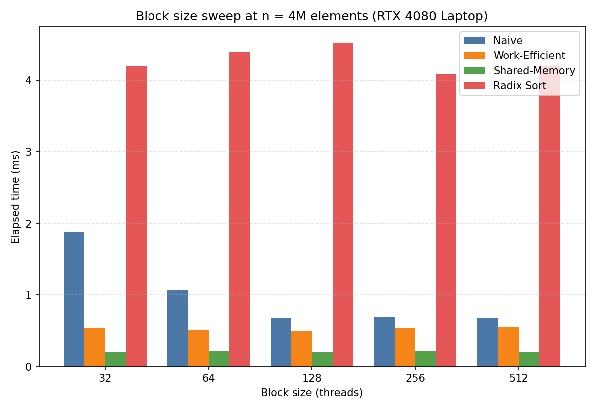
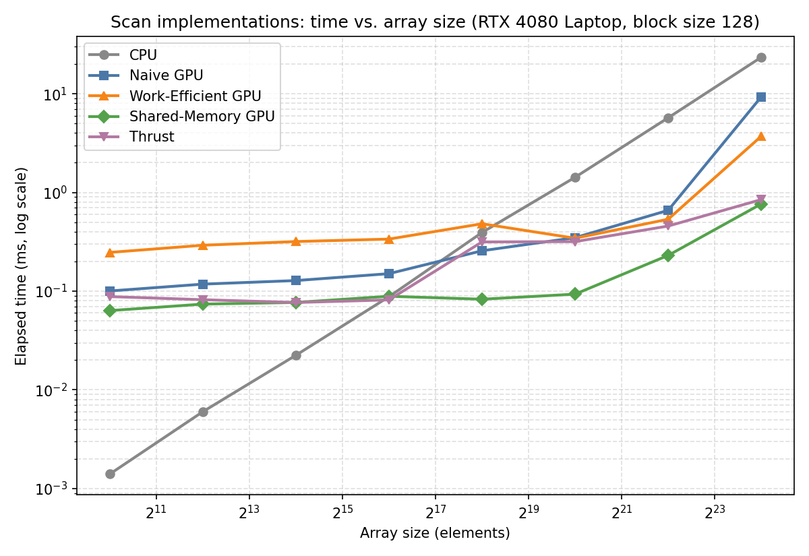
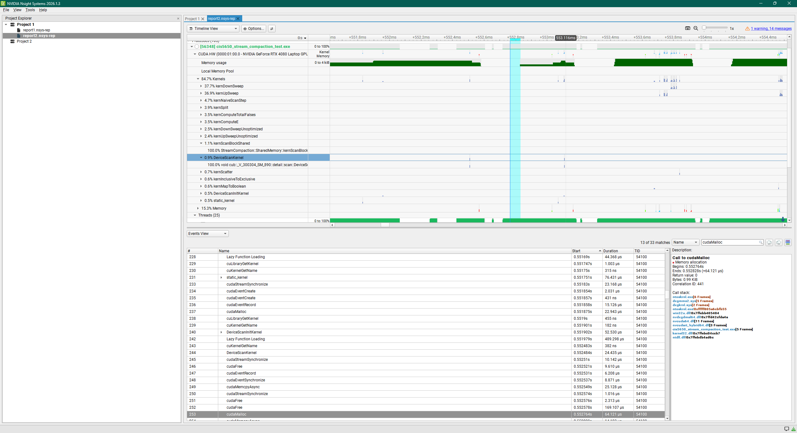

CUDA Stream Compaction
======================

**University of Pennsylvania, CIS 565: GPU Programming and Architecture, Project 2**

* Weike Qian
* Tested on: Windows 11, Intel Core i9-13980HX @ 2.2GHz 32GB, NVIDIA GeForce RTX 4080 Laptop GPU 12GB

## Overview

Exclusive scan (prefix sum) and stream compaction implemented from scratch in CUDA, in several progressively faster forms, plus two extra-credit extensions built on top of them.

| Implementation | File | Notes |
|---|---|---|
| CPU scan / compaction | `cpu.cu` | Serial baseline; also the correctness reference for every GPU test |
| Naive GPU scan | `naive.cu` | Hillis-Steele, `O(n log n)` work, double-buffered in global memory |
| Work-efficient GPU scan + compaction | `efficient.cu` | Blelloch up/down-sweep, `O(n)` work, in place, padded to a power of two |
| Thrust scan | `thrust.cu` | Wrapper around `thrust::exclusive_scan` |
| Shared-memory scan *(extra credit)* | `sharedmem.cu` | GPU Gems 3 Ex. 39-2, recursive multi-block, bank-conflict free |
| Radix sort *(extra credit)* | `radix.cu` | LSD radix sort reusing the work-efficient scan |

Stream compaction removes zeros from an int array via map → scan → scatter (`kernMapToBoolean` / `kernScatter` in `common.cu`), the same pattern that will later remove terminated paths in the path tracer.

## Performance Analysis

All timings are Release builds, measured with the provided `PerformanceTimer` (CUDA events for GPU, `std::chrono` for CPU), excluding initial/final `cudaMalloc` and `cudaMemcpy`.

### Block size

Block size is a CMake cache variable (`cmake -S . -B build -DBLOCK_SIZE=256`) so it could be swept without editing four `#define`s per data point. Measured at n = 4,194,304:



| Block size | Naive | Work-Efficient | Shared-Memory | Radix Sort |
|---|---|---|---|---|
| 32  | 1.891 ms | 0.537 ms | 0.202 ms | 4.196 ms |
| 64  | 1.078 ms | 0.519 ms | 0.220 ms | 4.393 ms |
| **128** | **0.682 ms** | **0.496 ms** | 0.207 ms | 4.522 ms |
| 256 | 0.690 ms | 0.539 ms | 0.215 ms | **4.090 ms** |
| 512 | 0.676 ms | 0.552 ms | **0.206 ms** | 4.195 ms |

32 threads/block is bad everywhere — too few warps per block to hide memory latency. Above 128 everything is flat within noise, because at this array size occupancy has stopped being the limiter for all four kernels. **128 is used as the default**: at or within noise of the best for three of the four, and clearly best for Naive, which is the most latency-sensitive.

### Scan vs. array size



| n | CPU | Naive | Work-Efficient | Shared-Memory | Thrust |
|---|---|---|---|---|---|
| 1,024 | 0.001 ms | 0.100 ms | 0.247 ms | 0.063 ms | 0.088 ms |
| 16,384 | 0.022 ms | 0.128 ms | 0.318 ms | 0.077 ms | 0.077 ms |
| 65,536 | 0.088 ms | 0.150 ms | 0.337 ms | 0.089 ms | 0.082 ms |
| 262,144 | 0.393 ms | 0.257 ms | 0.482 ms | 0.083 ms | 0.315 ms |
| 1,048,576 | 1.426 ms | 0.348 ms | 0.344 ms | 0.093 ms | 0.317 ms |
| 4,194,304 | 5.711 ms | 0.659 ms | 0.535 ms | 0.230 ms | 0.457 ms |
| 16,777,216 | 23.454 ms | 9.312 ms | 3.714 ms | 0.765 ms | 0.847 ms |

### Where the time actually goes

**Every GPU scan here is memory-bound, not compute-bound.** The additions themselves are nearly free on a GPU; what separates these implementations is how many times each element round-trips through global memory, and whether those trips are coalesced.

* **Below ~64K elements the CPU wins.** Every GPU implementation has a floor of roughly 0.1–0.3 ms set by kernel-launch overhead, and work-efficient needs `2 log2(n)` launches to naive's `log2(n)`. A serial loop over a few thousand elements finishes before that floor is even reached.

* **Naive beats work-efficient until n ≈ 10⁶**, despite doing `O(n log n)` work instead of `O(n)`. Two reasons, both memory-related rather than arithmetic: naive needs half as many kernel launches, and its `data[k] + data[k-offset]` access pattern stays perfectly coalesced, whereas work-efficient's sweeps have adjacent threads touching addresses `2*stride` apart — once stride grows past a few dozen, one warp's 32 accesses land in 32 separate cache lines instead of 1–2. Only past 10⁶ does the `O(n)` work advantage finally outweigh those costs (3.7 ms vs 9.3 ms at n = 16.7M).

* **The shared-memory version is fastest at every size**, and its lead grows with n (12x over global work-efficient at 16.7M). It attacks the actual bottleneck: keeping a block's whole chunk on chip means global round-trips stop scaling with `log2(n)` and instead scale with recursion depth (2–3 here). It gets `O(n)` arithmetic *and* coalesced global access at the same time.

* **Radix sort is the slowest thing measured** (4.4 ms at n = 4M for 6 bits) because it is essentially one full compaction per bit, so it inherits work-efficient's memory-bound behavior `numBits` times over.

### Inside Thrust

Thrust sits between work-efficient and shared-memory, with a visible bump at n = 262,144 and 1,048,576 (~0.316 ms, worse than its own trend). Profiling with Nsight Systems explains why rather than leaving it to guesswork:



The kernel list confirms the work is genuinely CUB's, not mine — `DeviceScanInitKernel` and `DeviceScanKernel` (`void cub::_V_300304_SM_890::detail::scan::DeviceS...`) appear alongside my own `kern*` kernels. The event trace shows the reason for the bump:

```
cudaEventRecord                          <- timer().startGpuTimer()
cudaMalloc      22.943 us                <- CUB internal scratch buffer
DeviceScanInitKernel
DeviceScanKernel
cudaFree         9.610 us                <- CUB frees it again
cudaEventRecord                          <- timer().endGpuTimer()
cudaMemcpyAsync                          <- thrust::copy, D2H
cudaFree, cudaFree                       <- dv_in / dv_out destructors
```

`exclusive_scan` allocates and frees its own temporary buffer **inside the timed region**, on every single call, even though both `device_vector`s handed to it are already GPU-resident and correctly sized. A separate CLI profile at n = 1,048,576 measured this pair at 58.6 µs + 129.5 µs ≈ **0.19 ms of the 0.317 ms total, about 60%**. This is the price of a generic library entry point that cannot assume anything persists between calls; a hand-written scan reusing its own buffers never pays it.

Reproduce with:
```
nsys profile --trace=cuda --cuda-memory-usage=true -o thrust_profile -- build\bin\Release\cis5650_stream_compaction_test.exe
nsys stats --report cuda_api_trace --format csv --output apitrace thrust_profile.nsys-rep
```

## Extra Credit

### Optimizing the work-efficient scan (+5)

The textbook up/down-sweep launches `n` threads at every level and discards the idle ones with a modulo test. That is wasteful in a way that only shows up on real hardware: GPUs schedule in 32-thread warps, so at depth `d` — where only `n / 2^(d+1)` elements are updated — nearly every warp is still scheduled just to have 31 of its 32 threads immediately fail the test, and the survivors pay for a genuinely expensive integer modulo (no hardware divider; `stride` is a runtime value so the compiler cannot strength-reduce it).

The version used by `scan()` instead launches exactly as many threads as there is work and maps them densely with one multiply, shrinking the grid every level:

```cuda
int index = threadIdx.x + (blockIdx.x * blockDim.x);
int k = index * (stride << 1);
if (k >= n) return;
```

`Efficient::scanUnoptimized` keeps the textbook version so the difference can be measured directly. At n = 4,194,304, block size 128:

| | Time |
|---|---|
| Textbook indexing | 0.953 ms |
| Compacted thread indexing | **0.496 ms** |

**~1.9x from an index-calculation change alone**, with the algorithm itself untouched. It still doesn't beat naive at this size — as analyzed above, launch count and coalescing dominate, which is what motivated the shared-memory version below.

### Radix sort (+10)

`StreamCompaction::Radix::sort` — LSD radix sort, one bit per pass, built entirely on `Efficient::devScan` (exposed via `efficient.h` for reuse):

```
for each bit b, low to high:
    e[i]           = (bit b of idata[i]) == 0          // map
    f              = exclusive_scan(e)                  // work-efficient scan
    totalFalses    = e[n-1] + f[n-1]
    destination[i] = e[i] ? f[i] : i - f[i] + totalFalses
    scatter idata[i] -> odata[destination[i]]
```

Each pass is a stable partition on one bit; stability is what makes the sequence of passes sort correctly by induction. Two implementation notes: `totalFalses` is computed by a one-thread kernel on the device instead of being copied to the host, so the per-bit loop never forces a host sync; and only `ilog2ceil(max + 1)` bits are scanned rather than a fixed 32.

```cpp
StreamCompaction::Radix::sort(n, odata, idata);
```
```
input:  [  15  26  31  38   9  46  39   6  36   4  44  44   6 ...  15   0 ]
output: [   0   0   0   0   0   0   1   1   1   1   1   2   2 ...  49  49 ]
```

Verified against `std::sort` for both power-of-two and non-power-of-two sizes. At n = 4,194,304 with 6 bits it takes 4.4 ms — slower than a single scan by roughly the number of passes, since each bit repeats map + scan + scatter. A production radix sort (CUB) handles 4–8 bits per pass using in-block histograms, cutting full-array passes by the same factor.

### Shared-memory scan with bank-conflict avoidance (+10)

`StreamCompaction::SharedMemory::scan` implements GPU Gems 3 Example 39-1/39-2: an entire block's up/down-sweep happens in shared memory, so each element touches global memory exactly twice instead of `2 log2(n)` times.

Each block scans `2 * blockSize` elements and writes its chunk total to `blockSums`, which is then **recursively** scanned the same way — necessary because at n = 4M `blockSums` itself has 16,384 entries, far more than one block's chunk — after which each block adds its own prefix back in. Scratch buffers for every recursion level are allocated before the timer starts, so the timed region allocates nothing.

Shared memory is banked into 32 four-byte banks, and since every sweep stride is a power of two, unpadded Blelloch indices collide badly: at `stride = 16` every active thread hits bank 31, a full 32-way conflict. The fix inserts one padding word every 32:

```cuda
#define CONFLICT_FREE_OFFSET(i) ((i) >> 5)   // 5 = log2(32 banks)
```

The original 2007 GPU Gems text shifts by 4 for 16-bank hardware; every GPU since Fermi has 32 banks, so this must be 5 — an easy detail to get wrong when transcribing the paper.

At n = 4,194,304:

| | Time | vs. CPU |
|---|---|---|
| Work-efficient (global memory) | 0.535 ms | 10.7x |
| Thrust | 0.457 ms | 12.5x |
| **Shared-memory, conflict-free** | **0.230 ms** | **24.8x** |

Roughly 2x faster than Thrust, and it confirms the analysis above: cutting global round-trips was worth far more than any instruction-level tuning.

## Tests

Beyond the starter template, `src/main.cpp` adds (marked `Added test` in source):

* **work-efficient scan WITHOUT thread compaction** — the unoptimized sweep, for the comparison above.
* **shared-memory scan**, power-of-two and non-power-of-two.
* **radix sort**, power-of-two and non-power-of-two, verified against `std::sort`.

<details>
<summary>Full test program output (SIZE = 1 &lt;&lt; 8, BLOCK_SIZE = 128)</summary>

```
****************
** SCAN TESTS **
****************
    [  15  26  31  38   9  46  39   6  36   4  44  44   6 ...  15   0 ]
==== cpu scan, power-of-two ====
   elapsed time: 0.0004ms    (std::chrono Measured)
    [   0  15  41  72 110 119 165 204 210 246 250 294 338 ... 6581 6596 ]
==== cpu scan, non-power-of-two ====
   elapsed time: 0.0004ms    (std::chrono Measured)
    [   0  15  41  72 110 119 165 204 210 246 250 294 338 ... 6538 6580 ]
    passed
==== naive scan, power-of-two ====
   elapsed time: 0.114912ms    (CUDA Measured)
    passed
==== naive scan, non-power-of-two ====
   elapsed time: 0.039936ms    (CUDA Measured)
    passed
==== work-efficient scan, power-of-two ====
   elapsed time: 0.444256ms    (CUDA Measured)
    passed
==== work-efficient scan, non-power-of-two ====
   elapsed time: 0.14912ms    (CUDA Measured)
    passed
==== work-efficient scan WITHOUT thread compaction, power-of-two ====
   elapsed time: 0.149696ms    (CUDA Measured)
    passed
==== shared-memory scan, power-of-two ====
   elapsed time: 0.033024ms    (CUDA Measured)
    passed
==== shared-memory scan, non-power-of-two ====
   elapsed time: 0.00496ms    (CUDA Measured)
    passed
==== thrust scan, power-of-two ====
   elapsed time: 0.080576ms    (CUDA Measured)
    passed
==== thrust scan, non-power-of-two ====
   elapsed time: 0.031584ms    (CUDA Measured)
    passed

*****************************
** STREAM COMPACTION TESTS **
*****************************
    [   3   0   3   2   1   0   1   0   0   2   2   2   2 ...   3   0 ]
==== cpu compact without scan, power-of-two ====
   elapsed time: 0.0006ms    (std::chrono Measured)
    [   3   3   2   1   1   2   2   2   2   1   1   2   2 ...   3   3 ]
    passed
==== cpu compact without scan, non-power-of-two ====
   elapsed time: 0.0003ms    (std::chrono Measured)
    [   3   3   2   1   1   2   2   2   2   1   1   2   2 ...   2   3 ]
    passed
==== cpu compact with scan ====
   elapsed time: 0.001ms    (std::chrono Measured)
    [   3   3   2   1   1   2   2   2   2   1   1   2   2 ...   3   3 ]
    passed
==== work-efficient compact, power-of-two ====
   elapsed time: 0.143008ms    (CUDA Measured)
    passed
==== work-efficient compact, non-power-of-two ====
   elapsed time: 0.171264ms    (CUDA Measured)
    passed

*****************************
** RADIX SORT TESTS        **
*****************************
    [  15  26  31  38   9  46  39   6  36   4  44  44   6 ...  15   0 ]
==== radix sort, power-of-two ====
   elapsed time: 0.925536ms    (CUDA Measured)
    [   0   0   0   0   0   0   1   1   1   1   1   2   2 ...  49  49 ]
    passed
==== radix sort, non-power-of-two ====
   elapsed time: 0.871616ms    (CUDA Measured)
    [   0   0   0   0   1   1   1   1   1   2   2   3   3 ...  49  49 ]
    passed
```
</details>

## Build Notes

`stream_compaction/CMakeLists.txt` was modified beyond the `SOURCE_FILES` list:

* Added `radix.*` and `sharedmem.*` to the source list.
* Added `-Xcompiler=/Zc:preprocessor` under MSVC. CUDA 13.3's CCCL headers (used by Thrust) hard-error under MSVC's default traditional preprocessor (`C1189`) and ask for the conforming one; unrelated to any implementation choice here.
* Added a `BLOCK_SIZE` cache variable (default 128), passed through as a compile definition, so the block-size sweep could be driven from the command line. The matching fallback `#define` lives in `common.h`, replacing the per-file `blockSize` defines the template started with.
